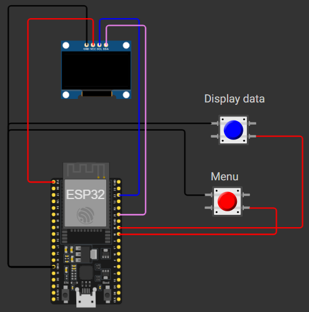
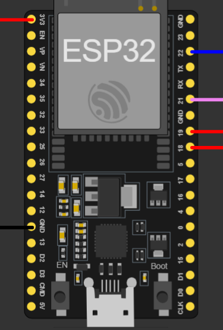

# ESP32 Weather Station

Simple ESP32 Arduino sketch that connects to Wi-Fi, queries the OpenWeather API for Paris, and prints the raw JSON response plus the temperature to the serial monitor.

## What It Does

The current sketch:

1. connects to the Wi-Fi network defined in `secrets.h`;
2. sends an HTTP GET request to OpenWeather every 10 seconds;
3. parses the JSON response with `Arduino_JSON`;
4. prints the raw payload and the `main.temp` value to the serial monitor.

## Requirements

- an ESP32 board;
- the Arduino IDE, or another ESP32-compatible setup;
- the `WiFi`, `HTTPClient`, and `Arduino_JSON` libraries;
- an OpenWeather API key;
- a local `secrets.h` file.

## Files in This Project

- `weather_station.ino`: main sketch;
- `secrets.h`: local credentials file used by the sketch;
- `secret.h.example`: template you can copy to create your local `secrets.h`;
- `.gitignore`: ignores `secrets.h` so your credentials stay local.

## Wiring

This project currently uses an ESP32, an OLED display, and two push buttons.





Current wiring logic based on the sketch:

- button on GPIO 18 is used to change the displayed metric;
- button on GPIO 19 is used to toggle between the title and the value;
- the OLED display is initialized on I2C with address `0x3C`;
- the display must be powered correctly and share the same ground as the ESP32;
- the buttons are configured with `INPUT_PULLUP`, so they should be wired to ground when pressed.

If your wiring does not match the images, update the GPIOs in `weather_station.ino` to match your board connections.

## Setup

1. Open the `weather_station` folder in the Arduino IDE.
2. Install the `Arduino_JSON` library if it is not already installed.
3. Copy `secret.h.example` to `secrets.h`.
4. Fill in your Wi-Fi name, Wi-Fi password, and OpenWeather API key.
5. Select your ESP32 board and upload the sketch.

Example `secrets.h` content:

```cpp
#pragma once

const char* WIFI_SSID = "YOUR_WIFI_SSID";
const char* WIFI_PASSWORD = "YOUR_WIFI_PASSWORD";
const char* OPENWEATHER_API_KEY = "YOUR_OPENWEATHER_API_KEY";
const char* CITY = "YOUR_CITY";
const char* COUNTRY = "YOUR_COUNTRY";
```

## Serial Monitor

Open the serial monitor at `115200 baud` to see:

- the Wi-Fi connection status;
- the HTTP response code;
- the raw JSON returned by OpenWeather;
- the temperature from `main.temp`.

## Current Behavior

- The weather request is hardcoded for `Paris,FR`.
- The request currently uses plain HTTP.
- The refresh interval is controlled by `timerDelay`, which is set to 10 seconds.

## Possible Improvements

- add `&units=metric` to display Celsius;
- make the city configurable in `weather_station.ino`;
- improve error handling for HTTP and JSON parsing.

